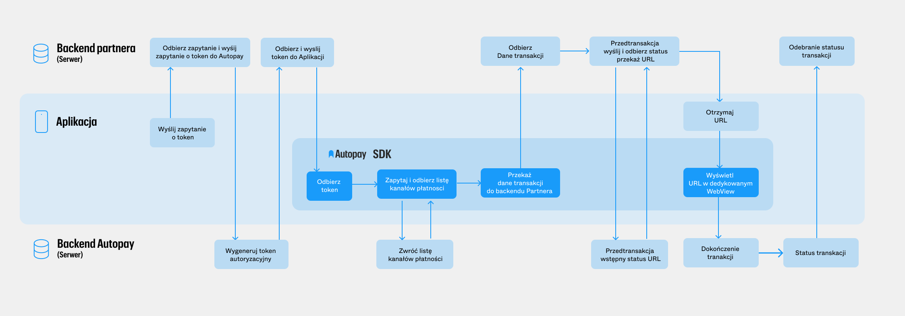
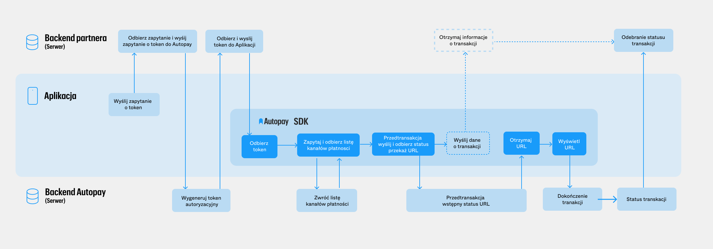

# Autopay mobile SDK

### Czym jest Autopay SDK?

**Autopay SDK** jest gotową biblioteką służącą do realizowania płatności mobilnych na platformach **Android** i **iOS**. Obsługujemy różne formy płatności: **Google Pay, Apple Pay, BLIK, karty płatnicze, przelewy bankowe**. **SDK** zostało przetłumaczone na język angielski i niemiecki.

Przy realizacji płatności **SDK** współpracuje ściśle z backendem. W ten sposób zapewniamy najbezpieczniejszą obsługę transakcji mobilnych.

Realizacja płatności może odbywać się w trzech wariantach:

*   **Wariant I (mieszany)** - proces tworzenia transakcji odbywa się po stronie backendu, a SDK wspiera pełną natywność, wykorzystując token transakcyjny otrzymany z backendu.

    **Zalety:**

    * Pełne stylowanie wyglądu w SDK
    * Pełna natywność (formatka kartowa, Apple Pay, Google Pay, Blik, Visa Mobile)
    * Możliwość wykorzystania OCR i NFC
    * Pełna swoboda w implementacji możliwych form płatności
    * Dane o wystartowanych transakcjach są przetrzymywane po stronie backendu

    **Wady:**

    * Większe zaangażowanie zespołu backendowego

<figure><figcaption></figcaption></figure>

***

*   **Wariant II** - wykorzystujący token transakcyjny otrzymany z backendu.

    **Zalety:**

    * Pełne stylowanie wyglądu w SDK
    * Pełna natywność (formatka kartowa, Apple Pay, Google Pay, Blik, Visa Mobile)
    * Możliwość wykorzystania OCR i NFC
    * Backend partnera nie musi implementować startu przedtransakcji, odbioru odpowiedzi itp. - te zadania wykonuje SDK

    **Wady:**

    * Konieczność synchronizacji danych o wykonanych płatnościach z backendem partnera

<figure><figcaption></figcaption></figure>

***

*   **Wariant III** - całość procesu po stronie backendu, gdzie tworzona jest transakcja (SDK otrzymuje tylko link do kontynuacji transakcji)

    **Zalety:**

    * Prosta implementacja - tylko jeden widok
    * Możliwość implementacji wszystkich płatności (również płatność automatyczna)

    **Wady:**

    * Nie jest to rozwiązanie stricte natywne
    * Brak Apple Pay
    * Brak OCR i NFC
    * Brak stylowania konkretnych kontrolek
    * Wyświetlanie paywalla Autopay w webview

<figure><figcaption></figcaption></figure>

### Natywnie czy WebView?

W aplikacji mobilnej ekrany **SDK** mogą być wywoływane na dwa sposoby:

* **Natywnie** - doświadczenie użytkownika jest niezmienne. Ekrany z formami płatności prezentowane są wewnątrz aplikacji mobilnej.
* **WebView** - doświadczenie użytkownika jest przerywane. Ekrany z formami płatności są prezentowane na zewnętrznych stronach www.

### Korzyści dla biznesu

* **Dzięki możliwości dopasowania wyglądu Autopay SDK uzyskasz efekt pełnej integralności wizualnej z Twoją aplikacją, co przełoży się na lepsze wrażenia z zakupów** - wiele elementów Autopay SDK można ostylować pod aplikację klienta: przyciski, kolory, loadery itp.
* **Dzięki lepszemu doświadczeniu użytkownika podnosimy konwersję zakupów koszyka** - estetyczna wizualnie i szybko działająca forma płatności to zdecydowana korzyść dla kupującego.
* **Umożliwiamy płatność w aplikacji najpopularniejszymi sposobami płatności: Google Pay, Apple Pay, BLIK, Visa Mobile, przelew bankowy, karta płatnicza** - obsługujemy metody płatności dobrze znane przez kupujących.
* **Transakcja oraz dane użytkownika są bezpieczne** - wszelkie dane trzymane są w naszym centrum danych.
* **Prostota implementacji w każdej aplikacji** - ułatwiamy pracę developerowi dostarczając proste do integracji narzędzie.

### Sposoby wykorzystania Autopay SDK

* Wybór metody płatności za towar w koszyku.
* Przyjmowanie opłat za towar lub usługę np. BLIK.
* Dodanie karty płatniczej (wraz z jej aktywacją) jako źródło płatności automatycznej za usługę.
* Dodanie karty płatniczej, z której będzie pobierana opłata cykliczna.

Chcesz zobaczyć jak działa **Autopay SDK** jeszcze przed implementacją w Twojej aplikacji? Sięgnij po demonstracyjną aplikację, w której prezentujemy różne warianty implementacji **Autopay SDK**.
