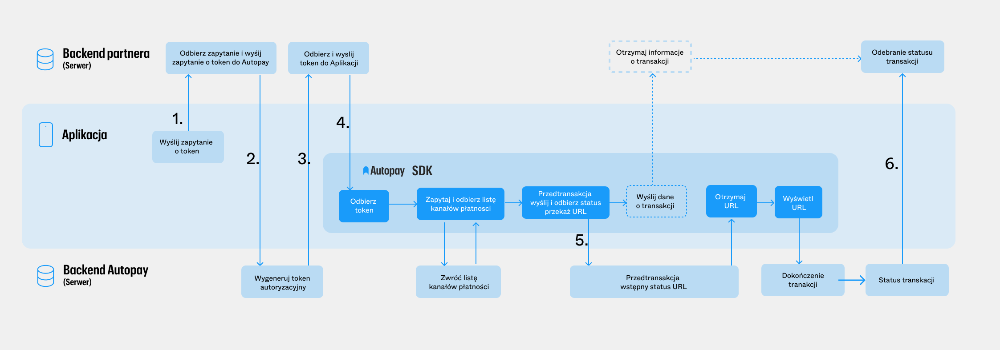
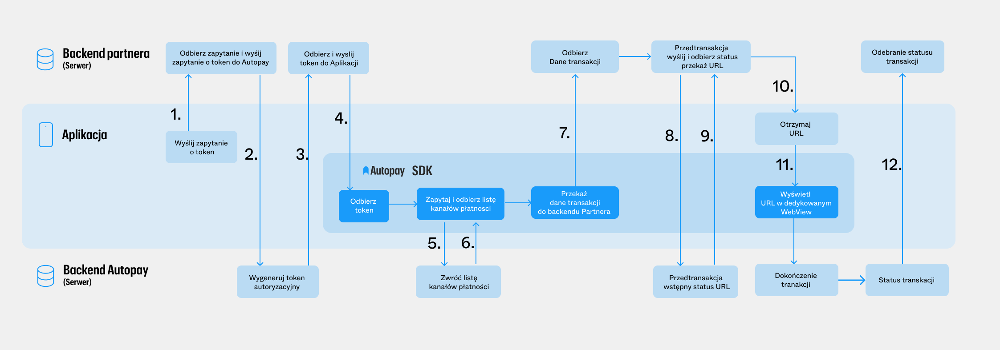
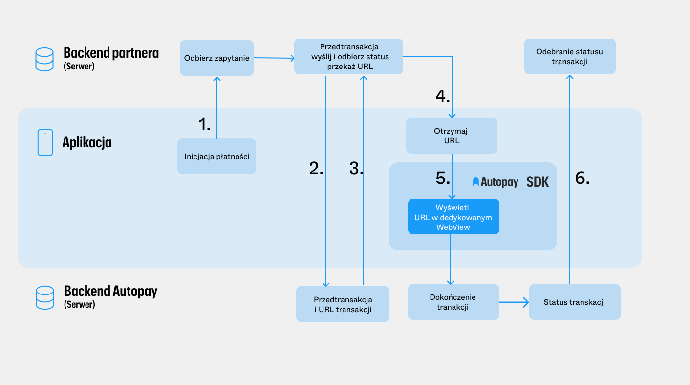

# Android

## 1. Przygotowanie projektu - wymagana konfiguracja

**PAMIĘTAJ**: **SDK** wspiera system Android w wersji **>= 8.0 (API 26)**. Dodatkowe wymagania:

* Android Gradle Plugin 8.12.0
* Gradle 9.0

Biblioteka została napisana w technologii Jetpack Compose (Compose BOM - 2025.08.00) z wykorzystaniem Javy 11.

### build.gradle (aplikacja)

SDK jest dystrybuowane przez Maven Central. Upewnij się, że repozytorium Maven Central jest dodane do konfiguracji Gradle w Twoim projekcie:

```groovy
dependencyResolutionManagement {
    repositories {
        google()
        mavenCentral()
    }
}
```

Następnie, w pliku `build.gradle` modułu, w którym planujesz użycie SDK, dodaj odpowiednią zależność:

`implementation("eu.autopay.pay:sdk:X.Y.Z")`, gdzie `X.Y.Z` to aktualny numer wersji **SDK** (4.0.0).

### OCR

Jeśli chcesz korzystać z wersji z obsługą Google OCR, użyj:

`implementation("eu.autopay.pay:sdk-ocr:X.Y.Z")`, gdzie `X.Y.Z` to aktualny numer wersji **SDK** (4.0.0).

### Jeśli język domyślny aplikacji jest inny niż język domyślny SDK

**SDK** wspiera języki EN, PL, DE, gdzie EN jest wersją domyślną. Jeśli twoja aplikacja korzysta z PL lub DE, **SDK** automatycznie będzie wyświetlać treści w tych językach.

Aby zapewnić poprawne wyświetlanie regulaminów, powinno się ustawić ich domyślny język wyświetlania w metodzie inicjalizacyjnej `Autopay.init()` poprzez parametr `regulationsFallbackLanguageCode`, gdzie jego domyślna wartość to **PL**

**UWAGA**: Pamiętaj o upewnieniu się, że backend Autopay wspiera zwracanie regulaminów w języku jaki ustawisz jako domyślny, w przeciwnym wypadku nie uda się rozpocząć płatności.

## 2. Tutorial - przykładowa implementacja

Poniższy tutorial opisuje sposób integracji biblioteki w wariancie z wykorzystaniem tokenu transakcyjnego uzyskanego z backendu aplikacji (Wariant 2). Zalecany jest wariant mieszany – z użyciem `WebView` i tworzeniem transakcji po stronie backendu. Aplikacja otrzymuje jedynie link do kontynuacji, który następnie jest ładowany w komponencie [APWebView za pomocą metody loadUrl](https://github.com/Autopay-S-A/mobile-sdk-docs/blob/develop/android/tutorial-przykladowa-implementacja/README.md#apwebview).

Wykonaj poniższe czynności, aby zintegrować Twoją aplikację na Androida z **Autopay SDK**:

<figure><figcaption></figcaption></figure>



Aplikacja odpytuje swój backend o token transakcyjny (akcja dzieje się bez udziału SDK).



Backend aplikacji odpytuje backend Autopay o token transakcyjny (opis w dokumencie [**Specyfikacja integracji Serwisu Partnera z Systemem Płatności Online Autopay w zakresie obsługi transakcji – Usługa pobrania tymczasowego Tokenu**](https://github.com/Autopay-S-A/mobile-sdk-docs/blob/develop/android/download/System_platnosci_online_obsluga_transakcji_Dodatek_oAuth_1.0.0.pdf)).



Backend aplikacji otrzymuje token transakcyjny ważny 1h.



Backend aplikacji przekazuje token transakcyjny do aplikacji mobilnej.



Aplikacja wykorzystuje token do dokonania transakcji.



Status transakcji zostaje przesłany do backendu partnera jako ITN (punkt [**5. Natychmiastowe powiadomienia o zmianie statusu transakcji wejściowej**](https://developers.autopay.pl/online/dokumentacja#powiadomienia-natychmiastowe-\(itn\)) w dokumencie _Specyfikacja integracji Serwisu Partnera z Systemem Płatności Online Autopay w zakresie obsługi transakcji i rozliczeń_).



### Klasa AutopayConfig

```kotlin
Autopay.init(
    AutopayConfig.Builder(
            token = "",
            serviceId = "serviceID",
            acceptorId = "acceptorID",
            environmentType = APEnvironmentType.PROD,
        )
        .enableLogging(false)
        .googlePayMerchantId(null)
        .contextPath("/payment")
        .currencies(listOf("PLN"))
        .regulationsFallbackLanguageCode("PL")
        .merchantCountryCode("PL")
        .build()
)
```

Do pobrania listy kanałów płatności oraz startu transakcji wymagane jest utworzenie obiektu `AutopayConfig` za pomocą `AutopayConfig.Builder` zainicjalizowanego specjalnym **tokenem transakcyjnym** do bezpośredniej komunikacji **SDK** z **Systemem Płatności Online BM**, **numerem serwisu** i **numerem akceptanta** przydzielonymi przez **System Płatności Online BM** oraz **adresem środowiska Systemu Płatności Online BM**. Używając obiekt `AutopayConfig` należy zainicjować SDK za pomocą metody `Autopay.init()` - najlepiej wywołać ją w klasie pochodnej `Application`.

Wymagane pola:

* `token`
* `serviceId`
* `acceptorId`
* `environmentType` - `APEnvironmentType.DEV` lib `APEnvironmentType.PROD`, w zależności od środowiska (sandbox lub produkcyjne)

Opcjonalne pola:

* `regulationsFallbackLanguageCode` - kod języka regulaminów, w przypadku gdy w domyślnym języku urządzenia nie są dostępne. Kod w formacie ISO-3166-1 alfa-2 (domyślnie `PL`)
* `contextPath` - ścieżka endpointu inicjującego transakcję, domyślnie `/payment`
* `enableLogging` - włącza logowanie danych w **SDK**, domyślnie `false`, **niezalecane** ustawienie na `true` w wersjach produkcyjnych. Wartości numeru karty płatniczej, kodu CVV oraz tokenu karty płatniczej są anonimizowane.
* `googlePayMerchantId` — [identyfikator merchanta Google Pay](https://developers.autopay.pl/online/dokumentacja#google-pay)
* `merchantCountryCode` — kod kraju w formacie ISO-3166-1 alfa-2 (domyślnie `PL`)
* `currencies` — lista obsługiwanych walut (domyślnie tylko `PLN`); zaleca się podanie jednej waluty. **Płatność zostanie wykonana w pierwszej walucie podanej do listy currencies!**

Inicjalizację można przeprowadzić również w dowolnym innym momencie cyklu życia aplikacji, **ale zawsze przed użyciem komponentów SDK lub metod klasy** `Autopay`.

**UWAGA**: Token transakcyjny ma ograniczony czas ważności, tym samym przed każdym użyciem metody z klasy `Autopay` zalecane jest pobranie z backendu aplikacji nowego tokenu transakcyjnego i wywołanie metody `updateToken(token: String)` w klasie `Autopay`, w celu ustawienia nowego tokenu.

### Informacje ogólne

Poniżej przedstawiono podstawowe użycie **SDK Autopay** z wykorzystaniem udostępnionych widoków. Przykładową implementację można znaleźć w aplikacji demonstracyjnej w "Plikach do pobrania".

⚠️ **Widoki SDK są zależne od danych z REST API**, dlatego ich wysokość może przekraczać wysokość ekranu urządzenia. **Zaleca się opakowanie ich w widok scrollowalny**, aby nie obciąć żadnej części widoków SDK.

Widoki:

* nie zawierają tła — należy je nadać nadrzędnemu widokowi,
* nie posiadają marginesów ani paddingów — należy dodać je samodzielnie.

### Lista kanałów płatności

Za wyświetlanie rozbudowanego widoku listy kanałów płatności odpowiadają klasy `APGatewayListCompose` oraz `APGatewayListView` w zależności, czy korzystasz w swojej aplikacji z `Jetpack Compose` czy tradycyjnie z widoków opartych o `xml`. Widoki te obsługują automatyczne pobieranie (z backendu Autopay) i wyświetlanie dostępnych kanałów płatności. Po rozwinięciu grupy kanałów, SDK wykonuje zapytanie o kwotę opłaty konsumenckiej oraz odpowiednie regulaminy. Wysokość opłaty konsumenckiej jest zależna od modelu biznesowego jaki został ustalony dla merchanta. Każda rozwinięta grupa kanałów płatności pozwala na rozpoczęcie transakcji.

```kotlin
APGatewayListCompose(
    amount = BigDecimal("29.00"),
    paymentSummary = "Testowa płatność",
    visibleGateways = APGatewayPaymentGroup.entries,
    customerEmail: String? = null,
    customerPhone: String? = null,
    orderId: String? = null,
    onPreTransactionDone = { preTransaction: APPreTransaction -> },
    onPaymentStateChange = { sdkState: APSdkState -> },
    onPreTransactionError = { throwable: Throwable -> }
    finishBeforePreTransaction: ((APTransactionData) -> Unit)? = null
)
```

```java
APGatewayListView gatewayView = view.findViewById(R.id.gatewayList);
gatewayView.setAmount(new BigDecimal("29.00"));
gatewayView.setPaymentSummary("Testowa płatność");
gatewayView.setCustomerEmail("example@email.com");
gatewayView.setCustomerPhone("123123123");
gatewayView.setPaymentSummary("Testowa płatność");
gatewayView.setOrderId("");
gatewayView.setOnPreTransactionDone(apPreTransaction -> {
   return Unit.INSTANCE;
});
gatewayView.setOnPaymentStateChange(apSdkState -> {
   return Unit.INSTANCE;
});
gatewayView.setOnPreTransactionError(error -> {
   return Unit.INSTANCE;
});
gatewayView.setFinishBeforePreStransaction(transactionData -> {
   return Unit.INSTANCE;
});
```

```xml
<eu.autopay.pay.sdk.ui.list.APGatewayListView
   android:id="@+id/gatewayList"
   android:layout_width="match_parent"
   android:layout_height="wrap_content" />
```

Konfigurowalne parametry:

* `amount` — wymagany; kwota transakcji bez opłaty konsumenckiej
* `paymentSummary` — tekst w podsumowaniu płatności; jeśli null lub pusty, podsumowanie nie będzie widoczne
* `visibleGateways` — lista wyświetlanych grup kanałów płatności (domyślnie wszystkie)
* `customerEmail` - dodatkowy parametr z emailem użytkownika, dołączany do dokonywanej transakcji. Zaleca się podanie jeśli posiadamy jego wartość
* `customerPhone` - dodatkowy parametr z numerem telefonu użytkownika, dołączany do dokonywanej transakcji. Zaleca się podanie jeśli posiadamy jego wartość
* `orderId` - opcjonalny identyfikator transakcji, musi mieć 32 znaki z zakresu "0123456789ABCDEFGHIJKLMNOPQRSTUVWXYZabcdefghijklmnopqrstuvwxyz", jeśli nie spełni tego kryterium, będzie wygenerowany automatycznie
* `onPreTransactionDone` — callback po udanej inicjalizacji transakcji (może zwrócić `redirectUrl`, którego otworzenie jest **wymagane** w `APWebView`)
* `onPreTransactionError` — callback w przypadku błędu przy inicjalizacji transakcji oraz w przypadku wygaśnięcia tokenu
* `onPaymentStateChange` — callback reagujący na zmianę stanu widoku (ładowanie, wyświetlenie listy, rozwinięcie grupy, rozpoczęcie transakcji)
* `finishBeforePreTransaction` - callback opcjonalny, jeśli nie jest nullem, wtedy `onPreTransactionDone` jest ignorowane, zwraca zestaw danych potrzebnych do samodzielnego rozpoczęcia transakcji z wykorzystaniem swojego backendu (Wariant I)

### Podsumowanie płatności

Jeśli `paymentSummary` zawiera wartość, widok wyświetli nagłówek z kwotą. Po rozwinięciu grupy kanałów, jeśli pobrane regulaminy dla kanału płatności posiadają parametr `serviceModel` o wartości `PAYER`, pobierana i dodawana jest opłata konsumencka, aktualizująca sumę.

**Wyjątek:** Dla **Przelewu bankowego** opłata i regulaminy ładowane są dopiero po wyborze banku.

### Regulaminy

* SDK automatycznie pobiera i prezentuje użytkownikowi zestaw dokumentów regulaminowych odpowiednich dla wybranego kanału płatności.
* Wymagane regulaminy mogą posiadać checkboxy - brak zgody blokuje transakcję
* Długie zgody można rozwinąć przyciskiem „Zobacz więcej”
* Możliwość wyświetlenia pełnych treści regulaminów (przycisk „Zapoznaj się z treścią”)
* W celu ukrycia sekcji regulaminów przekazujemy odpowiednie wartości w `Autopay.setRegulationsHidden`. Umożliwia to merchantowi wyświetlenie regulaminów w innym miejscu aplikacji.


_**Ważne:**_ W przypadku przekazania w funkcji `setRegulationsHidden` typu `APGatewayPaymentGroup.CARD` sekcja regulaminów nie zostanie wyświetlona zarówno na kanale płatności "Karta płatnicza" jak i aktywacji karty płatniczej.


### Grupy kanałów płatności

Wyświetlane są na podstawie danych z REST API, ale można je ograniczyć parametrem `visibleGateways`. Wyświetlane są tylko kanały, które udostępniają płatność w walucie podanej jako pierwszej do listy `currencies`.

**Uwaga**: SDK narzuca kolejność ich wyświetlania.

Każda grupa zawiera przycisk „Zmień formę płatności”, prowadzący z powrotem do listy wszystkich grup. Widoki zawierają także regulaminy i przycisk rozpoczęcia transakcji (aktywny tylko po spełnieniu wszystkich warunków).

#### Płatności Blika

* Wymagane jest wpisanie 6-cyfrowego kodu
* Przycisk aktywuje się po wpisaniu ostatniej cyfry

#### Karta płatnicza / Płatność automatyczna

* Nazwa zależy od konfiguracji: „Karta płatnicza” lub „Karta płatnicza - płatność automatyczna”, druga z nich jest używana jeśli z backendu Autopay dostaniemy **tylko** formę płatności z typem **PŁATNOŚĆ AUTOMATYCZNA KARTOWA**.
* Możliwa aktywacja płatności automatycznej przy pomocy przełącznika. Switch pojawia się w sytuacji gdy backend Autopay zwraca nam obie formy płatności. Jeśli będzie to jedna z form, zostanie on ukryty.
* Wszystkie pola formularza są wymagane.
* Wariant z OCR'em umożliwia skanowanie karty (kamera/NFC).
* Poprawne wypełnienie aktywuje przycisk płatności.
* Formatka kartowa spełnia wymagania PCI DSS i gwarantuje, że żadne wrażliwe dane kartowe nie trafiają do backendu ani aplikacji Merchanta.

Po poprawnym wypełnieniu formularza przycisk rozpoczynania płatności zmieni stan na aktywny.

**Dodatkowe opcjonalne zabezpieczenie ekranów z płatnością**

W trakcie płatności użytkownik może wpisywać dane karty płatniczej. Aby ekran z wpisanymi danymi nie wyświetlał tych danych w systemowej sekcji „Ostatnio używane aplikacje” oraz zabezpieczyć aplikację implementującą przed możliwością zrobienia zrzutu tych ekranów, można zabezpieczyć ją za pomocą systemowej flagi [WindowManager.LayoutParams#FLAG\_SECURE](https://developer.android.com/reference/android/view/WindowManager.LayoutParams#FLAG_SECURE). Flaga ta wyłącza możliwość robienia zrzutów ekranu, dlatego należy użyć jej tylko na wymaganych ekranach z płatnością, aby nie blokować zrzutów w innych częściach aplikacji.

#### Przelew bankowy

* Opłata konsumencka i regulaminy ładowane dopiero po wyborze banku
* Po załadowaniu dane umożliwiają rozpoczęcie transakcji

#### Płatności Visa Mobile

#### Google Pay

* Google Pay dostępny tylko w wariancie z OCR
* SDK samodzielnie wykrywa dostępność usługi
* Przycisk otwiera interfejs płatności Google Pay

**UWAGA:** Zaleca się ustawianie wartości `merchantId` (otrzymanej podczas rejestracji aplikacji w konsoli Google Pay) poprzez metodę `googlePayMerchantId()` w klasie `APConfig.Builder`. Wynika to z planowanego wprowadzenia przez Google tej wartości jako obowiązkowej.

**UWAGA**: Przed wdrożeniem kanału płatności **Google Pay** na środowisko produkcyjne niezbędne jest zweryfikowanie zgodnie z [listą kontrolną](https://developers.google.com/pay/api/android/guides/test-and-deploy/integration-checklist) umieszczoną na stronie **Google**, czy wszystkie wymagane kroki z integracji zostały wykonane.

**UWAGA**: Wdrożenie na produkcję wymaga odpowiedniego podpisania aplikacji oraz jej włączenia na [profilu programisty](https://developers.google.com/pay/api/android/guides/test-and-deploy/deploy-your-application) w **Google Pay**.

### APWebView

SDK zawiera własną implementację `WebView` w postaci klasy `APWebView`

```kotlin
public fun loadUrl(
   url: String,
   transactionCallback: (APResult?) -> Unit,
   eventCallback: (APEvent?) -> Unit,
   errorCallback: (APError?) -> Unit,
)
```

```kotlin
AndroidView(
   factory = { context ->
      val view = APWebView(context)
      view.canGoBack()
      view.loadUrl(
         url = "https://redirectUrl.com",
         transactionCallback = { apResult: APResult? ->
            ...
         },
         eventCallback = { apEvent: APEvent? ->
            ...
         },
         errorCallback = { apError: APError? ->
            ...
         },
      )
      view
   },
   modifier = Modifier.fillMaxSize(),
)
```

```xml
<eu.autopay.pay.sdk.ui.webview.APWebView
            android:id="@+id/webView"
            android:layout_width="match_parent"
            android:layout_height="match_parent" />
```

```java
((APWebView) view.findViewById(R.id.webView))
   .loadUrl(
      "https://redirectUrl.com",
      result -> {
         ...
          return Unit.INSTANCE;
      },
      event -> {
         ...
          return Unit.INSTANCE;
      },
      error -> {
         ...
          return Unit.INSTANCE;
      }
   );
```

* `url` - url przekierowania otrzymany z rozpoczętej transakcji
* `transactionCallback` — informuje o zakończeniu transakcji. Może być nullem ponieważ jest to wstępna informacja o statusie transakcji. Dla potwierdzenia rezultatu należy skorzystać z metody `checkTransactionStatus(orderId)` z klasy `Autopay`
* `eventCallback` — zwraca zdarzenia typu `APEvent`
* `errorCallback` — obsługuje błędy transakcji

**UWAGA**: W przypadku startu transakcji w `WebView`, z wybranym typem kanału płatności jako karta płatnicza, niezbędne może się okazać ustawienie dodatkowych atrybutów (`APRecurringAction`, `APRecurringAcceptanceState`) w obiekcie `APTransactionData`.

**Zalecane użycie**: do obsługi `redirectUrl` po inicjalizacji transakcji w `onPreTransactionDone`.

### Analiza rezultatu transakcji

Rezultat transakcji jest otrzymywany w metodach `onPreTransactionDone` i `onActivationDone` i jest taki sam dla wszystkich typów transakcji/kanałów płatności. Rezultat transakcji zwracany przez kanał płatności jest tylko wstępną informacją o statusie transakcji (może być nullem). Jeśli w `APPreTransaction.redirectUrl` znajduje się wartość, dokończenie transakcji należy wykonać w `APWebView`. Jeśli w obiekcie `APPreTransaction` występuje parametr `reason` można spróbować go zmapować na enumerator `APErrorType`, jeśli uda się zmapować, definicje wartości tego enuma są opisane w definicji klasy [APErrorType](./#aperrortype).

[Dla potwierdzenia rezultatu](https://developers.autopay.pl/online/dokumentacja#odpytanie-o-status-transakcji) należy skorzystać z metody `checkTransactionStatus()` z klasy `Autopay`.

Jeśli `onPreTransactionError` zostanie zwrócony błąd, trasnakcja nie powiodła się.

**UWAGA**: Jeśli token wygaśnie, w `onPreTransactionError` zwrócony zostanie `Throwable`. Aby sprawdzić czy jest to wyjątek informujący o wygaśnięciu tokenu, należy wywołać `ErrorUtils.isTokenExpired()`. Po zwróceniu przez tę metodę true, należy zablokować interfejs użytkownika, pobrać nowy token, zaktualizować go w SDK metodą `Autopay.updateToken()`, odblokować interfejs i pozwolić użytkownikowi na kontynuowanie płatności. Jeśli `ErrorUtils.isTokenExpired()` zwróci false, płatność nie powiodła się i powinno to zostać obsłużone po stronie aplikacji implementującej.

### Kompletny przykład poprawnie zintegrowanej biblioteki

1. Inicjalizacja SDK podając poprawne dane:

```kotlin
Autopay.init(
    AutopayConfig.Builder(
            token = "",
            serviceId = "serviceID",
            acceptorId = "acceptorID",
            environmentType = APEnvironmentType.PROD,
        )
        .enableLogging(false)
        .googlePayMerchantId(null)
        .contextPath("/payment")
        .currencies(listOf("PLN"))
        .regulationsFallbackLanguageCode("PL")
        .merchantCountryCode("PL")
        .build()
)
```

W wersji Java:

```java
Autopay.init(new AutopayConfig.Builder(
    APEnvironmentType.DEV.INSTANCE,
    "token",
    "serviceId",
    "acceptorId"
)
.contextPath("/payment")
.enableLogging(true)
.googlePayMerchantId("merchantId")
.build());
```

2. Wewnątrz swojej kompozycji umieść `APGatewayListCompose`:

```kotlin
...
Column(
   Modifier.verticalScroll(rememberScrollState())
      .fillMaxWidth()
      .padding(horizontal = 16.dp, vertical = 12.dp)
) {
   APGatewayListCompose(
      BigDecimal("123.45"),
      paymentSummary = "Payment summary",
      customerEmail = "customer@email.com",
      customerPhone = "123456789",
      onPreTransactionDone = { preTransaction: PreTransaction ->
         // handle preTransaction.redirectUrl or preTransaction.reason as? APErrorType
      },
      onPaymentStateChange = { sdkState: APSdkState ->
         // handle sdkState
      },
      onPreTransactionError = { throwable: Throwable ->
         if (it.isTokenExpired()) {
            // Display progress that blocks UI, refresh token in your app, update it by using:
            // Autopay.updateToken("new_token_here")
            // Hide progress and let user use retry button inside SDK
         } else {
            // handle throwable
         }
      },
   )
}
...
```

Lub w wersji Java umieść `APGatewayListView` wewnątrz scrollowalnego widoku i uzupełnij mu dane w kodzie:

```xml
...
<ScrollView
   android:layout_width="match_parent"
   android:layout_height="0dp"
   android:layout_weight="1">

   <eu.autopay.pay.sdk.ui.list.APGatewayListView
      android:id="@+id/gatewayList"
      android:layout_width="match_parent"
      android:layout_height="wrap_content"
      android:paddingHorizontal="16dp"
      android:paddingVertical="12dp" />
 </ScrollView>
 ...
```

```java
...
@Override
public void onViewCreated(@NonNull View view, @Nullable Bundle savedInstanceState) {
    super.onViewCreated(view, savedInstanceState);

    APGatewayListView gatewayView = view.findViewById(R.id.gatewayList);
    gatewayView.setAmount(new BigDecimal("123.45"));
    gatewayView.setCustomerEmail("customer@email.com");
    gatewayView.setCustomerPhone("123456789");
    gatewayView.setPaymentSummary("Payment summary");
    gatewayView.setOnPreTransactionDone(apPreTransaction -> {
        // handle apPreTransaction.getRedirectUrl() or apPreTransaction.reason as? APErrorType
        return Unit.INSTANCE;
    });
    gatewayView.setOnPaymentStateChange(apSdkState -> {
        // handle apSdkState
        return Unit.INSTANCE;
    });
    gatewayView.setOnPreTransactionError(throwable -> {
        if (ErrorUtils.INSTANCE.isTokenExpired(throwable)) {
            // Display progress that blocks UI, refresh token in your app, update it by using:
            // Autopay.updateToken("new_token_here");
            // Hide progress and let user use retry button inside SDK
        } else {
            // handle throwable
        }
        return Unit.INSTANCE;
    });
}
...
```

3. Następnie obsłużenie `redirectUrl` z obiektu `APPreTransaction` należy wykonać poprzez użycie widoku `APWebView`

```kotlin
AndroidView(
   factory = { context ->
      val view = APWebView(context)
      view.canGoBack()
      view.loadUrl(
         url = "https://redirectUrl.com",
         transactionCallback = { apResult: APResult? ->
            ...
         },
         eventCallback = { apEvent: APEvent? ->
            ...
         },
         errorCallback = { apError: APError? ->
            ...
         },
      )
      view
   },
   modifier = Modifier.fillMaxSize(),
)
```

Lub w wersji Java:

```xml
<eu.autopay.pay.sdk.ui.webview.APWebView
            android:id="@+id/webView"
            android:layout_width="match_parent"
            android:layout_height="match_parent" />
```

```java
((APWebView) view.findViewById(R.id.webView))
   .loadUrl(
      "https://redirectUrl.com",
      result -> {
         ...
          return Unit.INSTANCE;
      },
      event -> {
         ...
          return Unit.INSTANCE;
      },
      error -> {
         ...
          return Unit.INSTANCE;
      }
   );
```

Pełne przykłady uruchamiania WebView, wraz z trzymaniem stanu przy zmianie konfiguracji / śmierci procesu aplikacji są przedstawione w aplikacji DEMO w dziale "Pliki do pobrania".

## 3. Funkcjonalności zaawansowane

### Kontynuacja transakcji z linku

Oprócz startu transakcji bezpośrednio z aplikacji mobilnej, istnieje również możliwość kontynuacji transakcji na podstawie adresu `URL` otrzymanego z backendu aplikacji. W takim przypadku wykorzystywany jest widok [`APWebView`](./#apwebview), który posiada metodę `loadUrl(url: String, transactionCallback: (APResult?) -> Unit, eventCallback: (APEvent?) -> Unit, errorCallback: (APError?) -> Unit)`.

Wykonaj poniższe czynności, aby zintegrować Twoją aplikację w trybie kontynuacji transakcji.

#### Wariant I (mieszany)

<figure><figcaption></figcaption></figure>



Aplikacja odpytuje swój backend o token transakcyjny (akcja dzieje się bez udziału SDK).



Backend aplikacji odpytuje backend Autopay o token transakcyjny (opis w dokumencie [**Specyfikacja integracji Serwisu Partnera z Systemem Płatności Online Autopay w zakresie obsługi transakcji – Usługa pobrania tymczasowego Tokena**](https://github.com/Autopay-S-A/mobile-sdk-docs/blob/develop/android/download/System_platnosci_online_obsluga_transakcji_Dodatek_oAuth_1.0.0.pdf)).



Backend aplikacji otrzymuje token transakcyjny ważny 1h.



Backend aplikacji przekazuje token transakcyjny do aplikacji mobilnej.



SDK odpytuje o listę kanałów płatności backend Autopay.



SDK odbiera listę kanałów płatności i ładuje ją do natywnych widoków.



Aplikacja mobilna musi mieć zaimplementowaną metodę `finishBeforePreTransaction` w natywnych widokach, dzięki której SDK nie rozpoczyna transkacji po kliknięciu przycisku **Płacę**, tylko przekazuje do aplikacji mobilnej zestaw parametrów klasy `APTransactionData` (możliwe parametry: PaymentToken, AuthorizationCode, GatewayId, RegulationParams, WalletType), które aplikacja mobilna przesyła do backendu partnera.



Backend partnera wykonuje odpytanie o przedtransakcję do backendu Autopay, dla otrzymanych od aplikacji mobilnej parametrów transakcji.



W rezultacie żądania rozpoczęcia transakcji, backend partnera dostaje w zależności od kanału płatności: \* Link do kontynuacji transakcji (PBL, Fast Transfer, Google Pay, Aktywacja i płatność kartą) \* Wstępne informacje o statusie transakcji (Blik, Apple Pay)



Backend aplikacji przekazuje link do kontynuacji transakcji do aplikacji mobilnej jako odpowiedź na informację o potrzebie rozpoczęcia transakcji.



Aplikacja wykorzystuje link do kontynuacji transakcji poprzez wywołanie metody `loadUrl(url: String, transactionCallback: (APResult?) -> Unit, eventCallback: (APEvent?) -> Unit, errorCallback: (APError?) -> Unit)` z klasy [`APWebView`](./#apwebview).



Status transakcji zostaje przesłany do backendu partnera jako ITN (punkt **5. Natychmiastowe powiadomienia o zmianie statusu transakcji wejściowej** w dokumencie **Specyfikacja integracji Serwisu Partnera z Systemem Płatności Online Autopay w zakresie obsługi transakcji i rozliczeń**).



#### Wariant III

<figure><figcaption></figcaption></figure>



Aplikacja informuje swój backend o potrzebie wystartowania transakcji na skutek np. kliknięcia przycisku **Zapłać** (akcja dzieje się bez udziału SDK).



Backend aplikacji odpytuje backend Autopay o przedtransakcję (punkt **1.1 Przedtransakcja** w dokumencie **Specyfikacja integracji Serwisu Partnera z Systemem Płatności Online Autopay w zakresie obsługi transakcji i rozliczeń – Dodatek**).



Backend aplikacji otrzymuje link do kontynuacji transakcji.



Backend aplikacji przekazuje link do kontynuacji transakcji do aplikacji mobilnej jako odpowiedź na informację o potrzebie rozpoczęcia transakcji.



Aplikacja wykorzystuje link do kontynuacji transakcji poprzez wywołanie metody `loadUrl(url: String, transactionCallback: (APResult?) -> Unit, eventCallback: (APEvent?) -> Unit, errorCallback: (APError?) -> Unit)` z klasy [`APWebView`](./#apwebview).



Status transakcji zostaje przesłany do backendu partnera jako ITN (punkt **5. Natychmiastowe powiadomienia o zmianie statusu transakcji wejściowej** w dokumencie **Specyfikacja integracji Serwisu Partnera z Systemem Płatności Online Autopay w zakresie obsługi transakcji i rozliczeń**).



#### Przykładowa kontynuacja transackji z linku

Kontynuacja transakcji z linku realizowana jest poprzez uruchomienie klasy `APWebView` z linkiem przekierowania otrzymanym w ramach rozpoczętej transakcji.

```kotlin
AndroidView(
   factory = { context ->
      val view = APWebView(context)
      view.canGoBack()
      view.loadUrl(
         url = "https://redirectUrl.com",
         transactionCallback = { apResult: APResult? ->
            ...
         },
         eventCallback = { apEvent: APEvent? ->
            ...
         },
         errorCallback = { apError: APError? ->
            ...
         },
      )
      view
   },
   modifier = Modifier.fillMaxSize(),
)
```

Lub w wersji Java:

```xml
<eu.autopay.pay.sdk.ui.webview.APWebView
            android:id="@+id/webView"
            android:layout_width="match_parent"
            android:layout_height="match_parent" />
```

```java
((APWebView) view.findViewById(R.id.webView))
   .loadUrl(
      "https://redirectUrl.com",
      result -> {
         ...
          return Unit.INSTANCE;
      },
      event -> {
         ...
          return Unit.INSTANCE;
      },
      error -> {
         ...
          return Unit.INSTANCE;
      }
   );
```

Pełne przykłady uruchamiania WebView, wraz z trzymaniem stanu przy zmianie konfiguracji / śmierci procesu aplikacji są przedstawione w aplikacji DEMO w dziale "Pliki do pobrania".

### Aktywacja karty płatniczej

```kotlin
public APCardActivationCompose(
    onActivationDone: (APPreTransaction) -> Unit,
    onActivationError: (Throwable) -> Unit = {},
    finishBeforePreTransaction: ((APTransactionData) -> Unit)? = null,
    orderId: String? = null,
    activationTextColor: APThemeColor = APThemeColor(Color(0xFF282828), Color(0xFFFAFAFA)),
    activationTextSize: TextUnit = 12.sp
)
```

```java
APCardActivationView cardPaywall = view.findViewById(R.id.cardPaywall);

cardPaywall.setOnActivationDone(apPreTransaction -> {
   return Unit.INSTANCE;
});
cardPaywall.setOnActivationError(error -> {
   return Unit.INSTANCE;
});
cardPaywall.setOrderId("");
cardPaywall.setActivationTextColor(APThemeColor(Color.parseColor("282828"), Color.parseColor("FFAFAFA")));
cardPaywall.setActivationTextSize(12);
cardPaywall.setFinishBeforePreStransaction(transactionData -> {
   return Unit.INSTANCE;
});
```

```xml
<eu.autopay.pay.sdk.ui.card.APCardActivationView
   android:id="@+id/cardPaywall"
   android:layout_width="match_parent"
   android:layout_height="wrap_content" />
```

**SDK** udostępnia widok pozwalający na dokonanie aktywacji karty płatniczej. Występuje tutaj zarówno wersja dla Compose `APCardActivationCompose`, jak i implementacja dla aplikacji wykorzystujących widoki z XML'ami `APCardActivationView`.


**Zalecenie:** opakować widok w scrollowalny komponent, aby uniknąć zasłaniania widoku przez klawiaturę lub brak miejsca na ekranie urządzenia.


**UWAGA**: Jeśli token wygaśnie, w `onActivationError` zwrócony zostanie `Throwable`. Aby sprawdzić czy jest to wyjątek informujący o wygaśnięciu tokenu, należy wywołać `ErrorUtils.isTokenExpired()`. Po zwróceniu przez tę metodę true, należy zablokować interfejs użytkownika, pobrać nowy token, zaktualizować go w SDK metodą `Autopay.updateToken()`, odblokować interfejs i pozwolić użytkownikowi na kontynuowanie aktywacji.

* Wszystkie pola formularza są obowiązkowe.
* Niepoprawne uzupełnienie skutkuje pokazaniem błędu przy danym polu.
* Jeśli używany wariant SDK zawiera OCR – pojawi się ikona aparatu umożliwiająca odczyt danych karty.
* Jeżeli urządzenie obsługuje NFC – dostępna jest ikona NFC uruchamiająca skanowanie.
* Po poprawnym wypełnieniu formularza, przycisk aktywacji staje się aktywny.

### Indywidualne grupy płatności

**Autopay SDK** umożliwia użycie dedykowanych kanałów płatności, zamiast pełnej listy kanałów. Dla każdej grupy dostępne są oddzielne komponenty.

| **Grupa płatności** | **Compose**                 | **XML**                  |
| ------------------- | --------------------------- | ------------------------ |
| Banki               | `APBankGatewayCompose`      | `APBankGatewayView`      |
| BLIK                | `APBliKGatewayCompose`      | `APBlikGatewayView`      |
| Karty               | `APCardGatewayCompose`      | `APCardGatewayView`      |
| Google Pay          | `APGooglePayGatewayCompose` | `APGooglePayGatewayView` |
| Visa Mobile         | `APVisaGatewayCompose`      | `APVisaGatewayView`      |
| {.table--3}         |                             |                          |

Wspólne parametry:

* `amount` — wymagany; kwota transakcji bez opłaty konsumenckiej
* `customerEmail` - dodatkowy parametr z emailem użytkownika, dołączany do dokonywanej transakcji. Zaleca się podanie jeśli posiadamy jego wartość
* `customerPhone` - dodatkowy parametr z numerem telefonu użytkownika, dołączany do dokonywanej transakcji. Zaleca się podanie jeśli posiadamy jego wartość
* `orderId` - opcjonalny identyfikator transakcji, musi mieć 32 znaki z zakresu "0123456789ABCDEFGHIJKLMNOPQRSTUVWXYZabcdefghijklmnopqrstuvwxyz", jeśli nie spełni tego kryterium, będzie wygenerowany automatycznie
* `onPreTransactionDone` — callback po udanej inicjalizacji transakcji (może zwrócić `redirectUrl`, którego otworzenie jest **wymagane** w `APWebView`)
* `onPreTransactionError` — callback w przypadku błędu przy inicjalizacji transakcji oraz w przypadku wygaśnięcia tokenu
*   `finishBeforePreTransaction` - callback opcjonalny, jeśli nie jest nullem, wtedy `onPreTransactionDone` jest ignorowane, zwraca zestaw danych potrzebnych do samodzielnego rozpoczęcia transakcji z wykorzystaniem swojego backendu (Wariant I)

    `finishBeforePreTransaction` - callback opcjonalny, jeśli nie jest nullem, wtedy `onPreTransactionDone` jest ignorowane, zwraca zestaw danych potrzebnych do samodzielnego rozpoczęcia transakcji z wykorzystaniem swojego backendu (Wariant I)
*   `finishBeforePreTransaction` - callback opcjonalny, jeśli nie jest nullem, wtedy `onPreTransactionDone` jest ignorowane, zwraca zestaw danych potrzebnych do samodzielnego rozpoczęcia transakcji z wykorzystaniem swojego backendu (Wariant I)

    `finishBeforePreTransaction` - callback opcjonalny, jeśli nie jest nullem, wtedy `onPreTransactionDone` jest ignorowane, zwraca zestaw danych potrzebnych do samodzielnego rozpoczęcia transakcji z wykorzystaniem swojego backendu (Wariant I)


Jedynie dla płatnosci BLIK oraz Przelewów bankowych mamy dodatkowy parametr `contentHeader` będący odniesieniem do przestrzeni tłumaczeń pozwalający na zmianę nagłówka tych kanałów płatności.


Przykładowo dla banków jako grupy kanałów płatności (i analogicznie dla każdego innego widoku):

```kotlin
@Composable
public fun APBankGatewayCompose(
   amount: BigDecimal,
   customerEmail: String? = null,
   customerPhone: String? = null,
   orderId: String? = null,
   @StringRes contentHeader: Int? = null,
   onPreTransactionDone: (APPreTransaction) -> Unit = {},
   onPreTransactionError: (Throwable) -> Unit = {},
   finishBeforePreTransaction: ((APTransactionData) -> Unit)? = null,
)
```

```java
APBankGatewayView bankGateway = view.findViewById(R.id.bankGateway);

bankGateway.setAmount(new BigDecimal("1.23"));
bankGateway.setOnPreTransactionDone(apPreTransaction -> {
   return Unit.INSTANCE;
});
bankGateway.setOnPreTransactionError(error -> {
   return Unit.INSTANCE;
});
bankGateway.setFinishBeforePreStransaction(transactionData -> {
   return Unit.INSTANCE;
});
bankGateway.setCustomerPhone("");
bankGateway.setCustomerEmail("");
bankGateway.setOrderId("");
bankGateway.setContentHeader(R.string.example_header);
```

```xml
<eu.autopay.pay.sdk.ui.views.bank.APBankGatewayView
   android:id="@+id/bankGateway"
   android:layout_width="match_parent"
   android:layout_height="wrap_content" />
```

### Google Pay

**UWAGA**: Zaleca się ustawianie wartości `merchantId` (otrzymanej podczas rejestracji aplikacji w konsoli Google Pay) poprzez metodę `googlePayMerchantId()` w klasie `AutopayConfig.Builder`. Wynika to z planowanego wprowadzenia przez Google tej wartości jako obowiązkowej.

W przypadku integracji SDK w wariancie I (mieszanym), gdy aplikacja przesyła dane transakcji do swojego backendu, pomocna może okazać się statyczna metoda `extractPaymentTokenFromGooglePayPaymentToken()` z klasy `PreTransactionUtils`. Konwertuje ona `paymentToken` na format obsługiwany przez backend **Autopay**.

**UWAGA**: Przed wdrożeniem kanału płatności **Google Pay** na środowisko produkcyjne niezbędne jest zweryfikowanie zgodnie z [listą kontrolną](https://developers.google.com/pay/api/android/guides/test-and-deploy/integration-checklist) umieszczoną na stronie **Google**, czy wszystkie wymagane kroki z integracji zostały wykonane.

**UWAGA**: Wdrożenie na produkcję wymaga odpowiedniego podpisania aplikacji oraz jej włączenia na [profilu programisty](https://developers.google.com/pay/api/android/guides/test-and-deploy/deploy-your-application) w **Google Pay**.

### Regulaminy

Przed integracją **SDK** warto upewnić się w **Autopay** czy obsługa regulaminów i zgód dla płatności będzie odbywała się po stronie aplikacji mobilnej i **SDK**. W zależności od konfiguracji po stronie **Autopay**, jeśli regulaminy i zgody nie mają być wyświetlane w widokach mobilnych, należy w obiekcie `Autopay` wywołać metodę `setRegulationsHidden` z odpowiednimi grupami kanałów płatności. Niezgodność konfiguracji po stronie **Autopay** i stanu `setRegulationsHidden` w **SDK** może skutkować błędami podczas wykonywania transakcji.

## 4. Personalizacja

**SDK** umożliwia szereg globalnych personalizacji widoków, które udostępnia. Służy do tego metoda `Autopay.setUiStyle` przyjmująca z parametr obiekt `AutopayUIStyle`. Obiekt ten zawiera style domyślne oraz kolorystykę przedstawioną w aplikacji demonstracyjnej, tak by użytkownik mógł podmienić tylko to czego potrzebuje.


**SDK** dostarcza domyślną stylistykę widoków zgodną i dostosowaną do wymogów dostępności WCAG. Przy wykorzystaniu SDK i dokonywaniu zmian w kolorach, wymiarach, twórca aplikacji bierze na siebie odpowiedzialność za ich dobór aby spełnić wymogi dostępności.


```kotlin
public data class AutopayUIStyle(
    val typography: APTypography = APTypography(),
    val primaryButtonStyle: APButtonStyle = APButtonStyle.APPrimaryButtonStyle,
    val secondaryButtonStyle: APButtonStyle = APButtonStyle.APSecondaryButtonStyle,
    val tertiaryButtonStyle: APButtonStyle = APButtonStyle.APTertiaryButtonStyle,
    val inputStyle: APTextInputStyle = APTextInputStyle(),
    val gatewayButtonStyle: APGatewayButtonStyle = APGatewayButtonStyle(),
    val gatewayTitleStyle: APGatewayTitleStyle = APGatewayTitleStyle(),
    val checkboxStyle: APCheckboxStyle = APCheckboxStyle(),
    val switchStyle: APSwitchStyle = APSwitchStyle(),
    val radioButtonStyle: APRadioButtonStyle = APRadioButtonStyle(),
    val dialogStyle: APDialogStyle = APDialogStyle(),
    val loaderStyle: APLoaderStyle = APLoaderStyle(),
    val bankGridStyle: APBankGridStyle = APBankGridStyle(),
    val paymentSummaryStyle: APPaymentSummaryStyle = APPaymentSummaryStyle(),
    val dccPaymentFormStyle: APDCCPaymentFormStyle = APDCCPaymentFormStyle(),
    val errorColor: APThemeColor = APThemeColor(APColors.errorLight, APColors.errorDark),
    val footerIconsColor: APThemeColor = APThemeColor(APColors.greyDarkLight, APColors.greyDarkDark),
) {
    /** Builder class to make easier creation [AutopayUIStyle] object in Java projects. */
    public class Builder(private var styleInstance: AutopayUIStyle = AutopayUIStyle()) {

        public fun build(): AutopayUIStyle = styleInstance

        public fun typography(typography: APTypography): Builder {
            styleInstance = styleInstance.copy(typography = typography)
            return this
        }

        public fun primaryButtonStyle(primaryButtonStyle: APButtonStyle): Builder {
            styleInstance = styleInstance.copy(primaryButtonStyle = primaryButtonStyle)
            return this
        }

        public fun secondaryButtonStyle(secondaryButtonStyle: APButtonStyle): Builder {
            styleInstance = styleInstance.copy(secondaryButtonStyle = secondaryButtonStyle)
            return this
        }

        public fun tertiaryButtonStyle(tertiaryButtonStyle: APButtonStyle): Builder {
            styleInstance = styleInstance.copy(tertiaryButtonStyle = tertiaryButtonStyle)
            return this
        }

        public fun inputStyle(inputStyle: APTextInputStyle): Builder {
            styleInstance = styleInstance.copy(inputStyle = inputStyle)
            return this
        }

        public fun gatewayButtonStyle(gatewayButtonStyle: APGatewayButtonStyle): Builder {
            styleInstance = styleInstance.copy(gatewayButtonStyle = gatewayButtonStyle)
            return this
        }

        public fun gatewayTitleStyle(gatewayTitleStyle: APGatewayTitleStyle): Builder {
            styleInstance = styleInstance.copy(gatewayTitleStyle = gatewayTitleStyle)
            return this
        }

        public fun checkboxStyle(checkboxStyle: APCheckboxStyle): Builder {
            styleInstance = styleInstance.copy(checkboxStyle = checkboxStyle)
            return this
        }

        public fun switchStyle(switchStyle: APSwitchStyle): Builder {
            styleInstance = styleInstance.copy(switchStyle = switchStyle)
            return this
        }

        public fun radioButtonStyle(radioButtonStyle: APRadioButtonStyle): Builder {
            styleInstance = styleInstance.copy(radioButtonStyle = radioButtonStyle)
            return this
        }

        public fun dialogStyle(dialogStyle: APDialogStyle): Builder {
            styleInstance = styleInstance.copy(dialogStyle = dialogStyle)
            return this
        }

        public fun loaderStyle(loaderStyle: APLoaderStyle): Builder {
            styleInstance = styleInstance.copy(loaderStyle = loaderStyle)
            return this
        }

        public fun bankGridStyle(bankGridStyle: APBankGridStyle): Builder {
            styleInstance = styleInstance.copy(bankGridStyle = bankGridStyle)
            return this
        }

        public fun paymentSummaryStyle(paymentSummaryStyle: APPaymentSummaryStyle): Builder {
            styleInstance = styleInstance.copy(paymentSummaryStyle = paymentSummaryStyle)
            return this
        }

        public fun dccPaymentFormStyle(dccPaymentFormStyle: APDCCPaymentFormStyle): Builder {
            styleInstance = styleInstance.copy(dccPaymentFormStyle = dccPaymentFormStyle)
            return this
        }

        public fun errorColor(errorColor: APThemeColor): Builder {
            styleInstance = styleInstance.copy(errorColor = errorColor)
            return this
        }

        public fun footerIconsColor(footerIconsColor: APThemeColor): Builder {
            styleInstance = styleInstance.copy(footerIconsColor = footerIconsColor)
            return this
        }
    }
}
```

Klasa ta zawiera zestaw klas grupujących personalizację odpowiednich widoków oraz kilka ogólnych parametrów. W przypadku ustawiania kolorów dla danych elementów korzystamy z klasy `APThemeColor` przyjmującej 2 parametry: `lightColor` - wymagany kolor dla trybu jasnego, a także `darkColor` będący kolorem używanym w trakcie korzystania z ciemnego trybu w systemie. Kolor dla trybu ciemnego jest opcjonalny, jeśli nie zostanie podany, brana jest wartość koloru dla trybu jasnego.

**UWAGA** Bblioteka wspiera systemową obsługę trybu nocnego (dark/night mode). Aby kolorowanie elementów wizualnych działało poprawnie powinieneś podać we wszystkich miejscach wartość dla `darkColor`. Jeżeli nie używasz trybu nocnego w swojej aplikacji, powinieneś ustawić domyślny tryb `AppCompatDelegate.setDefaultNightMode(AppCompatDelegate.MODE_NIGHT_NO)` w klasie aplikacji lub w bazowym activity. Domyślnie SDK dostarcza kolory dla obu trybów.

Wszystkie parametry należące do biblioteki Compose mają swoje odpowiedniki, tak by można było je utworzyć w projektach pisanych w Javie:

* Dp, TextUnit - float konwertowany do tych wartości
* Color - integer
* FontWeight - integer
* TextStyle - osobna klasa `APTextStyleWrapper` mogąca być używana jako zamiennik

Każda klasa określająca styl ma także swoją klasę Builder, która może być pomocna w tworzeniu styli w projektach pisanych w Javie.

W klasie `AutopayUIStyle` możemy dostarczyć personalizację poszczególnych elementów:

* `errorColor` - kolor błędów
* `footerIconsColor` - kolor ikon partnerów występujący na dole listy kanałów płatności
* `typography` - zestaw styli tekstów wraz ze wspólnym kolorem domyślnym tekstów. System zakłada użycie biblioteki w 4 rozmiarach - 12, 14, 16, 18, o wadze 400. Jedynie czcionka o rozmiarze 12 ma swój pogrubiony odpowiednik o wadze 500. Każdy styl tekstu przekazywany jest w postaci parametrów **androidx.compose.ui.text.TextStyle**
  * `defaultTextColor` - kolor tekstu dla wszystkich styli tekstów w tym obiekcie, nie dotyczy koloru tekstów na przyciskach
  * `labelSmall` - mały styl tekstu, domyślnie wielkości 12.sp
  * `labelSmallBold` - mały styl tekstu pogrubiony, domyślnie waga 500, domyślnie wielkości 12.sp
  * `labelMedium` - średni styl tekstu, domyślnie wielkości 14.sp
  * `labelLarge`- wielki styl tekstu, domyślnie wielkości 16.sp
  * `labelXLarge` - największy styl tekstu, domyślnie wielkości 18.sp
* `primaryButtonStyle`, `secondaryButtonStyle`, `tertiaryButtonStyle`- zestaw parametrów stylizujących przyciski, odpowiednio: `primaryButtonStyle` - główny (wypełniony) w SDK - używany na większości ekranów, `secondaryButtonStyle` - przycisk dodatkowy (obramowany) w SDK, użwany w dialogu z odnośnikami do Regulaminów, dialogu przewalutowania, dialogu skanowania NFC, `tertiaryButtonStyle` - trzeci przycisk z domyślnie mniejszą czcionką, używany w sekcji regulaminów&#x20;
  * `containerColor` - kolor tła przycisku
  * `inactiveContainerColor` - kolor tła przycisku w stanie zablokowanym
  * `contentColor` - kolor treści przycisku
  * `inactiveContentColor` - kolor treści przycisku w stanie zablokowanym
  * `borderColor` - kolor obramowania przycisku
  * `inactiveBorderColor` - kolor obramowania przycisku w stanie zablokowanym
  * `radius` - promień zaokrąglenia przycisku
  * `minHeight` - minimalna wysokość przycisku
  * `textStyle` - tekst stylu przycisku
  * `borderWidth` - grubość obramowania
* `inputStyle` - zestaw parametrów stylizujących widoki wprowadzania danych tekstowych&#x20;
  * `inputTextStyle` - styl tekstu wprowadzanego
  * `inputTextColor` - kolor tekstu wprowadzanego
  * `placeholderTextColor` - kolor tekstu placeholdera
  * `labelTextStyle` - styl tekstu etykiety nad widokiem
  * `labelTextColor` - kolor tekstu etykiety nad widokiem
  * `errorTextStyle` - styl tekstu błędu pod widokiem
  * `errorTextColor` - kolor tekstu błędu pod widokiem
  * `borderInactiveColor` - kolor obramowania w stanie domyślnym
  * `borderActiveColor` - kolor obramowania w stanie zaznaczonym
  * `borderErrorColor` - kolor obramowania w przypadku błędu w formularzu
  * `backgroundColor` - kolor tła wewnątrz obramowania
  * `trailingIconsColor` - kolor ikon dodatkowych (OCR i NFC w formularzu karty płatniczej w okienku numeru karty płatniczej)
  * `radius` - promień załamania obramowania
  * `strokeWidth` - grubość obramowania
  * `spaceBetweenInputs` - odległość między polami w formularzu
* `gatewayButtonStyle` - zestaw parametrów stylizujących przycisk kanału płatności na liście kanałów płatności&#x20;
  * `backgroundColor` - kolor wypełniania wewnątrz obramowania
  * `borderColor` - kolor obramowania przycisku
  * `iconColor` - kolor ikon na przycisku - tylko w przypadku Karty płatniczej oraz Przelewów bankowych, pozostałe przyciski mają ikony wielokolorowe odpowiadające ich markom
  * `textColor` - kolor tekstu na przycisku
  * `textStyle` - styl tekstu na przycisku
  * `borderWidth` - grubość obramowania
  * `radius` - promień załamania obramowania
  * `minHeight` - minimalna wysokość przycisku
* `gatewayTitleStyle` - zestaw parametrów stylizujących tytuł kanału płatności po wybraniu danej formy i rozwinięciu jej szczegółów&#x20;
  * `backgroundColor` - kolor tła
  * `iconColor` - kolor ikon na przycisku - tylko w przypadku Karty płatniczej oraz Przelewów bankowych, pozostałe przyciski mają ikony wielokolorowe odpowiadające ich markom
  * `textColor` - kolor tekstu na przycisku
  * `textStyle` - styl tekstu na przycisku
  * `radius` - promień załamania tła
* `checkboxStyle` - zestaw parametrów stylizujących widoki typu checkbox !\[APCheckboxStyle]\(images/android/00\_style\_checkbox.png =51x213){.no-gallery}
  * `checkedColor` - kolor wypełnienia zaznaczonego checkboxa
  * `uncheckedColor` - kolor obramowania w stanie domyślnym niezaznaczonym
  * `errorColor` - kolor obramowania w przypadku błędu spowodowanego niezaznaczeniem checkboxa
* `switchStyle` - zestaw parametrów stylizujących widoki typu switch !\[APSwitchStyle]\(images/android/00\_style\_switch.png =55x84){.no-gallery}
  * `checkedThumbColor` - kolor przełącznika w stanie zaznaczonym
  * `uncheckedThumbColor` - kolor przełącznika w stanie niezaznaczonym
  * `checkedTrackColor` - kolor tła w stanie zaznaczonym
  * `uncheckedTrackColor` - kolor tła w stanie niezaznaczonym
  * `checkedBorderColor` - kolor obramowania w stanie zaznaczonym
  * `uncheckedBorderColor` - kolor obramowania w stanie niezaznaczonym
* `radioButtonStyle` - zestaw parametrów stylizujących widoki typu radio button !\[APRadioButtonStyle]\(images/android/00\_style\_radio\_buttons.png =40x60){.no-gallery}
  * `checkedColor` - kolor w stanie zaznaczonym
  * `uncheckedColor` - kolor w stanie odznaczonym
* `dialogStyle` - zestaw parametrów stylizujących wyświetlane okna w SDK
  * `dialogRadius` - zaokrąglenie okna
  * `dialogBackgroundColor` - kolor tła okna
* `loaderStyle` - zestaw parametrów stylizujących widoki ładowania danych !\[APLoaderStyle]\(images/android/00\_style\_loader.png =103x79){.no-gallery}
  * `color` - kolor loadera
  * `size` - rozmiar loadera
* `bankGridStyle` - zestaw parametrów stylizujących siatkę banków na grupie "Przelewy bankowe"&#x20;
  * `columns` - liczba kolumn w siatce banków
  * `cellHeight` - wysokość komórki z ikoną banku
  * `radius` - promień załamania obramowania komórki
  * `backgroundColor` - kolor wypełnienia komórki wewnątrz obramowania
  * `checkedBorderColor` - kolor obramowania zaznaczonego banku
  * `uncheckedBorderColor` - kolor obramowania banku gdy nie jest zaznaczony
* `paymentSummaryStyle` - zestaw parametrów stylizujących etykietę z podsumowaniem płatności&#x20;
  * `backgroundColor` - kolor tła etykiety
  * `borderColor` - kolor obramowania etykiety
  * `borderWidth` - grubość obramowania etykiety
  * `dividerColor` - kolor separatora w etykiecie
  * `dividerHeight` - grubość separatora w etykiecie
  * `radius` - promień załamania obramowania etykiety
* `dccPaymentFormStyle` - zestaw parametrów stylizujących okno z formularzem przewalutowania przy płatności kartą&#x20;
  * `selectedBorderColor` - kolor obramowania etykiety zaznaczonej waluty
  * `unselectedBorderColor` - kolor obramowania etykiety niezaznaczonej waluty
  * `cellRadius` - promień załamania obramowania etykiety z walutą
  * `cellBackgroundColor` - kolor wypełnienia etykiety z walutą wewnątrz obramowania

Dodatkowo jako developer możesz zmienić wartość nagłówka na płatności typu BLIK za pomocą metody `Autopay.setBLIKContentHeader(@StringRes value: Int)` przekazując odpowiednie tłumaczenie - w przypadku korzystania z listy, bądź jako parametr `contentHeader` jeśli korzystasz z pojedynczych widoków `APBlikGatewayCompose/APBlikGatewayView`. Podobnie jest w przypadku płatności Przelewem bankowym, istnieje metoda `Autopay.setBankContentHeader(@StringRes value: Int)` przekazująca odpowiednie tłumaczenie lub parametr `contentHeader` jeśli korzystasz z pojedynczych widoków `APBankGatewayCompose/APBankGatewayView`.

### Samodzielna komunikacja z serwisem Autopay

**SDK** udostępnia szereg metod pozwalających na samodzielną obsługę płatności z serwisem **Autopay**. Wszystkie metody muszą być wywołane w osobnym wątku ze względu na komunikację HTTP odbywającą się wewnątrz ich implementacji. Tak samo jak w przypadku korzystania z dedykowanych widoków, na początku **trzeba wykonać inicjalizację całego SDK**.

Wszystkie metody dostępne są z obiektu `Autopay`.

#### Pobieranie listy kanałów płatności

`public suspend fun getGatewaysList(): List<APGateway>?` `public fun getGatewaysListBlocking(): List<APGateway>?`

Wywołanie tych metod zwraca w rezultacie listę dostępnych kanałów płatności w podanej konfiguracji. Najistotniejszym elementem w dalszej komunikacji z serwisem **Autopay** będzie parametr `APGateway.gatewayId`, który posłuży do rozpoczynania transakcji, a także pozwala na pobranie regulaminów i opłaty konsumenckiej dla danego kanału płatności.

#### Pobieranie regulaminów

`public suspend fun getRegulationsForGateway(gatewayId: Long): List<APRegulation>?` `public fun getRegulationsForGatewayBlocking(gatewayId: Long): List<APRegulation>?`

Wywołanie tych metod zwraca listę regulaminów dla wybranego kanału płatności na podstawie jego identyfikatora. Pobieranie regulaminów nie jest wymagane, ale zalecane, ze względu na możliwą wymagalność ich akceptacji, która będzie musiała być przekazana jako parametry w obiekcie przekazywanym do metody rozpoczynającej transakcję w serwisie **Autopay**. Aby uzyskać takie parametry należy dla każdego regulaminu wywołać metodę `fun getPaymentParamsIfNeeded(): Map<String, String>`, która zwraca mapę takich parametrów jako klucz-wartość.

#### Pobieranie opłaty konsumenckiej

`public suspend fun getCustomerFeeForGateway(gatewayId: Long, amount: BigDecimal): APCustomerFee?` `public fun getCustomerFeeForGatewayBlocking(gatewayId: Long, amount: BigDecimal): APCustomerFee?`

Opcjonalne metody zwracające informację o wymaganej opłacie konsumenckiej i jej odbiorcy. Opłata konsumencka zależna jest od identyfikatora wybranego kanału płatności oraz kwoty transakcji. Nie jest to wymagane w celu rozpoczęcia transakcji, jednak informacja o tej opłacie pojawi się na stronie z adresu przekierowania.

#### Rozpoczynanie transakcji

`public suspend fun makeTransaction(transactionData: APTransactionData): APPreTransaction?` `public fun makeTransactionBlocking(transactionData: APTransactionData): APPreTransaction?`

Kluczowe metody rozpoczynające transakcję w serwisie **Autopay**. Na podstawie obiektu `transactionData` tworzony jest request pozwalający na dokonanie transakcji. Jedynym wymaganym parametrem tej klasy jest kwota `amount`, a brak podania parametru takiego jak `gatewayId`, będzie skutkować adresem przekierowania(`redirectUrl`), na którym będzie możliwość wyboru kanału płatności. Istnieje kilka kluczowych parametrów, które są wymagane dla danych kanałów płatności:

* `authorizationCode` - kod BLIK dla kanału BLIK
* `googlePaymentToken` - token transakcji Google Pay otrzymany z SDK Google Pay
* `params` - mapa parametrów w postaci klucz-wartość umożliwiająca przekazanie dodatkowych parametrów do transakcji.
  * W przypadku regulaminów tu powinny zostać dodane parametry otrzymana dla każdego regulaminu. Przykładowo: _"DefaultRegulationAcceptanceTime"_ - _"2022-02-22 02:02:02"_ _"DefaultRegulationAcceptanceState"_ - _"ACCEPTED"_ _"DefaultRegulationAcceptanceID"_ - _"123"_ Lub z prefixem _Recurring_ zamiast _Default_ zależnie od typu dostarczonego regulaminu.
  * Dla płatności Google Pay należy dodać parę `"WalletType"` = `"SDK_NATIVE"`
  * Dla płatności kartą z płatnością automatyczną należy dodać parę `"RecurringAction"` - `"INIT_WITH_PAYMENT"`
  * Dla aktywacji karty płatniczej należy dodać parę `"RecurringAction"` - `"INIT_WITH_REFUND"`

Zwracany obiekt transakcji - `APPreTransaction` - można obsłużyć w taki sam sposób otwierając url `redirectUrl` w dedykowanym widoku `APWebView`. Brak takiego zwracanego parametru lub jego pusta wartość, oznacza, że nie są wymagane dalsze kroki w aplikacji w procesowaniu transakcji, a w dalszym kroku można sprawdzić status transakcji na podstawie parametru `orderId`. Jeśli jednak obiekt posiada wartość parametru `reason`, oznacza to, że tworzenie transakcji się nie powiodło i ta wartość przedstawia powód niepowodzenia. Wartość parametru `reason` można spróbować zmapować na enum `APErrorType`, gdyż w większości przypadków powód niepowodzenia jest odwzorowaniem wartości tego enumeratora.

#### Sprawdzanie statusu transakcji

`public suspend fun checkTransactionStatus(orderId: String): APTransactionStatus?` `public fun checkTransactionStatusBlocking(orderId: String): APTransactionStatus?`

Metody pozwalające na sprawdzenie statusu transakcji na podstawie jej identyfikatora - `orderId`, otrzymanego przy rozpoczynaniu transakcji jako parametr `APPreTransaction.orderId`. Zwracany obiekt ma listę transakcji przypisanych do zamówienia o podanym identyfikatorze, z których każda ma swój własny status `paymentStatus` lub informacje zwrotną o błędzie w parametrze `paymentStatusDetails`.
