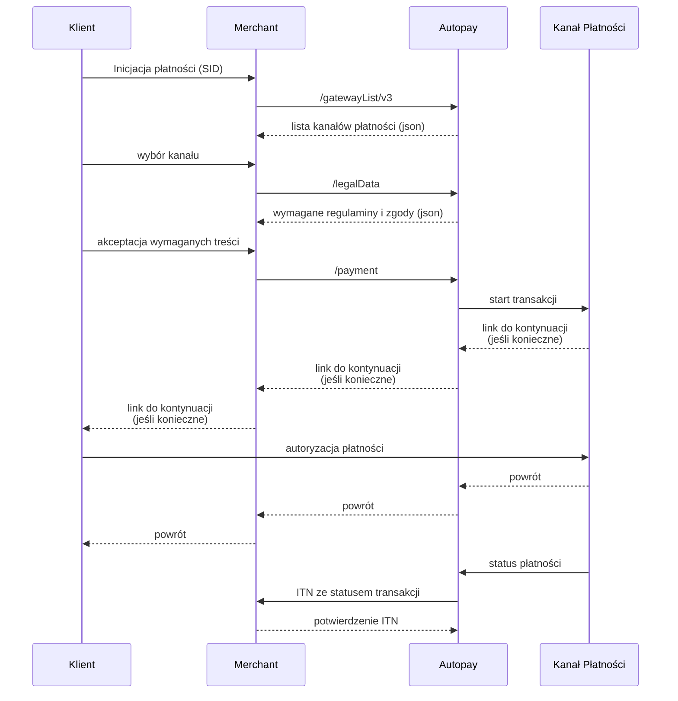

# Wybór metody płatności po stronie merchanta

## Model WhiteLabel

Charakteryzuje się prezentacją kanałów płatności po stronie Merchanta. W tym celu należy pozyskać listę kanałów wraz z opisami z usługi `gatewayList/v3` oraz pozyskać listę niezbędnych regulaminów dla poszczególnych kanałów płatności (`/legalData`). Pozostała część procesu jest taka sama jak w modelu Paywall.

[Specyfikacja gatewayList](../bramka-platnosci-online/pozostale-operacje-api/gateway-list.md) · [Regulaminy i zgody](../bramka-platnosci-online/pozostale-operacje-api/legal-consents.md) · [Przedtransakcja](../bramka-platnosci-online/zaawansowane-scenariusze-platnosci/pretransaction.md)
