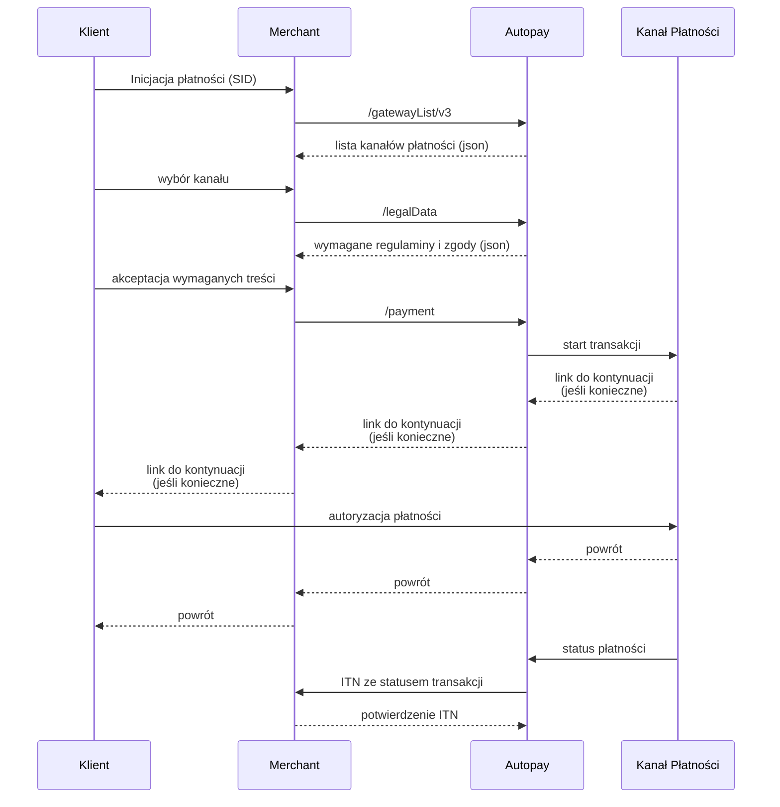

# whitelabel transaction

Poniżej znajduje się podstawowy schemat pierwszej transakcji Autopay w modelu, w którym Merchant prezentuje kanały płatności po swojej stronie (tzw. whitelabel). Proces zaczyna się od pobrania aktualnej konfiguracji kanałów, następnie pobrania danych prawnych wymaganych dla wybranego kanału, zainicjowania płatności przez `payment`, a kończy się asynchronicznym odebraniem i potwierdzeniem komunikatu ITN.





### Pobierz dostępne kanały płatności przez `gatewayList`

Backend Merchanta odpytuje Autopay o aktualną listę kanałów płatności:

```http
POST https://{host_bramki}/gatewayList/v3
Content-Type: application/json
```

Na podstawie odpowiedzi Merchant buduje widok wyboru metody płatności. Kluczowe dane z tego kroku to między innymi identyfikatory kanałów (`gatewayID`), nazwy, logotypy, waluty i informacje o dostępności kanału.


Wynik `gatewayList` warto cache'ować i regularnie odświeżać, aby nie blokować płatnika w przypadku chwilowej niedostępności API.




### Pobierz dane prawne przez `legalData`

Po wyborze kanału płatności Merchant pobiera listę regulaminów, zgód i innych obowiązków formalnych wymaganych dla danego scenariusza:

```http
POST https://{host_bramki}/legalData
Content-Type: application/json
```

Odpowiedź wskazuje, jakie treści należy pokazać klientowi i które identyfikatory akceptacji trzeba przekazać w starcie płatności. W zależności od modelu integracji mogą to być na przykład:

* `DefaultRegulationAcceptanceID` - identyfikator regulaminu usługi płatniczej,
* `RecurringAcceptanceID` - identyfikator regulaminu płatności automatycznej,
* status akceptacji, np. `ACCEPTED`, jeśli klient zaakceptował treść po stronie Merchanta.


Dane z `legalData` należy traktować jako część procesu transakcyjnego. Jeśli dla wybranego kanału wymagane są regulaminy lub zgody, ich identyfikatory powinny trafić do późniejszego wywołania `payment`.




### Zainicjuj płatność przez `payment`

Po wybraniu kanału i zebraniu wymaganych akceptacji backend Merchanta inicjuje transakcję w Autopay:

```http
POST https://{host_bramki}/payment
Content-Type: application/x-www-form-urlencoded
```

W żądaniu należy przekazać dane transakcji, między innymi:

* `ServiceID` - identyfikator serwisu,
* `OrderID` - unikalny identyfikator zamówienia po stronie Merchanta,
* `Amount` i `Currency` - kwotę oraz walutę,
* `GatewayID` - kanał wybrany na podstawie `gatewayList`,
* `CustomerEmail` - adres e-mail klienta,
* pola akceptacji wynikające z `legalData`, jeśli są wymagane,
* `Hash` - podpis żądania zgodny z konfiguracją serwisu.

Autopay zwraca odpowiedź startu transakcji. W zależności od kanału i scenariusza może ona zawierać link kontynuacji, status przyjęcia zlecenia albo informację o błędzie walidacji.


Odpowiedź synchroniczna z `payment` nie zastępuje ITN. Logikę biznesową, taką jak wydanie towaru lub uruchomienie usługi, należy oprzeć o poprawnie zweryfikowany komunikat ITN.




### Odbierz i potwierdź ITN

Po zmianie statusu transakcji Autopay wysyła do backendu Merchanta asynchroniczny komunikat ITN na skonfigurowany adres powiadomień.

Merchant powinien:

* odebrać komunikat ITN,
* zweryfikować `serviceID`, `orderID`, `amount`, `currency` i `hash`,
* rozpoznać status transakcji, np. `PENDING`, `SUCCESS` albo `FAILURE`,
* wykonać logikę biznesową tylko raz dla finalnego statusu,
* odpowiedzieć strukturą potwierdzenia z `CONFIRMED` albo `NOTCONFIRMED`.

Przykładowa odpowiedź potwierdzająca odebranie ITN:

```xml
<?xml version="1.0" encoding="UTF-8"?>
<confirmationList>
  <serviceID>ServiceID</serviceID>
  <transactionsConfirmations>
    <transactionConfirmed>
      <orderID>OrderID</orderID>
      <confirmation>CONFIRMED</confirmation>
    </transactionConfirmed>
  </transactionsConfirmations>
  <hash>Hash</hash>
</confirmationList>
```


Jeśli Autopay nie otrzyma poprawnej odpowiedzi na ITN, będzie ponawiać wysyłkę powiadomienia. Obsługa ITN powinna być idempotentna.



